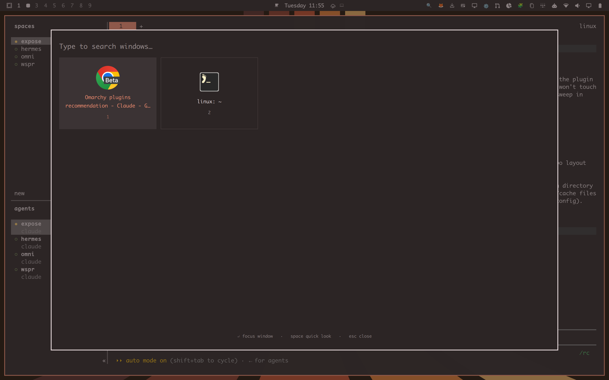

# Expose

A macOS-style window overview for [Omarchy](https://omarchy.org/) / Hyprland.



Trigger it with the top-left hot corner or `SUPER + E`. Type to filter
windows by title or app id, hit `Enter` to focus one (switching workspace
if needed), or hit `Space` on the highlighted card for a Quick Look
inspector (large icon, full title, app id, workspace, size, and
floating/fullscreen/XWayland/pid).

## Install

```
omarchy plugin add <this-repo-url> --enable
```

Then bind a key (optional — the hot corner works without one):

```lua
-- ~/.config/hypr/bindings.lua
o.bind("SUPER + E", "Expose", "omarchy-shell shell toggle ronnie.expose")
```

## Remove

```
omarchy plugin remove ronnie.expose
```

If you added the optional keybinding above, remove that line from
`~/.config/hypr/bindings.lua` too.

## License and dependencies

MIT — see [LICENSE](LICENSE). No dependencies beyond `hyprctl`, which
ships with Hyprland/Omarchy itself; nothing else is installed or required.

## How it works

- `Expose.qml` — the overlay itself. Window data is a fresh `hyprctl clients
  -j` query on every open, not Quickshell's `HyprlandToplevel.lastIpcObject`
  (which only reflects a window's state at creation time and never
  refreshes — using it produces stale sizes/flags).
- `HotCorner.qml` — a headless service that polls `hyprctl cursorpos` and
  summons the overlay after a short dwell in the top-left corner. Edit the
  `corner`/`zonePx`/`dwellMs` properties in the file to change which corner
  or how long the dwell is.
- Focusing the selected window shells out to `hyprctl dispatch` with
  `hl.dsp.focus({ window = "address:..." })` — this Hyprland build's IPC
  socket only accepts its own Lua dispatch syntax, so Quickshell's built-in
  `Hyprland.dispatch()` (which sends the classic dispatch string) gets
  rejected.

## Security notes

Window titles and app ids are supplied by whatever application owns the
window, not by the user, so they're treated as untrusted:

- App-id strings are rejected before they reach icon lookup if they look
  like a path or URI (`shell.appLibrary.iconSource()` treats a leading
  `/`, `file://`, or `image://` as a direct image source to load).
- All displayed text sets `textFormat: Text.PlainText` — Qt's default
  auto-detects and renders HTML-like markup in a string.
- Window addresses are regex-validated (`^0x[0-9a-fA-F]+$`) before being
  placed in a dispatch string.
- Title/app-id/workspace strings are length-capped.

Both `hyprctl` calls (`clients -j`, `cursorpos`) run as static argv arrays
with no shell involved, and `JSON.parse` output is validated before use.
